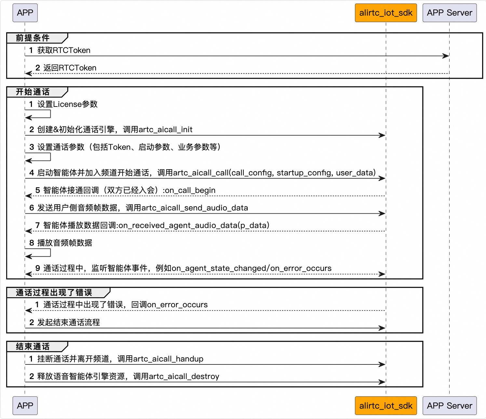

[English](README_English.md)

# AI实时互动Example（乐鑫ESP32-S3-BOX）
阿里云 · AI实时互动演示Demo，适用于乐鑫ESP32-S3-BOX

## 介绍
本Demo主要演示杰里智能硬件与智能体的实时通话，并提供核心场景的接口调用参考。

## 源码说明

### 源码下载
[下载地址](https://github.com/MediaBox-Demos/amdemos-lot-aicall/tree/main/esp32-s3)

### 源码结构
```
├── components                  // 
│   ├── ARTC                    // Ali ARTC SDK
│       ├── CMakeLists.txt             // SDK的CMakeLists.txt
│       ├── include                    // SDK 头文件目录
│       ├── lib                        // SDK .a库目录
├── main                       // mian源码目录
│   ├── artc_aicall_demo.c             // 智能体实时通话的Demo实现c文件
│   ├── artc_aicall_demo.h             // 智能体实时通话的Demo实现h文件
│   ├── artc_helper.c                  // 封装操作函数
│   ├── artc_helper.h                  // 封装操作函数
│   ├── audio_pipeline2.c              // 封装音频采集与播放
│   ├── audio_pipeline2.h              // 封装音频采集与播放
│   ├── main.c                         // 程序入口函数
│   ├── Kconfig.projbuild              // 工程编译配置文件
│   ├── CMakeLists.txt                 // main源码的CMakeLists
├── CMakeLists.txt             // 工程的CMakeLists
├── MakeFile                   // 
├── sdkconfig.defaults...      // 


```

### 环境要求
- 搭建ESP-IDF开发环境，请参考[ESP-IDF编程指南](https://docs.espressif.com/projects/esp-idf/zh_CN/latest/esp32/get-started/index.html)


### 前提条件
- 申请License，请联系商务经理
- 开通及创建智能体，详情参考[AI实时互动官网文档](https://help.aliyun.com/zh/ims/user-guide/create-agents-for-audio-and-video-calls)。创建智能体后，得到`智能体Id`、`智能体所在区域`、智能体关联RTC的`AppId`及`AppKey`，这些值会在下面用到。

## 跑通Example源码

- 请参考乐鑫官网搭建开发环境，本Demo需要用到音频3A，所以在esp-idf目录中还需要打一个补丁，否则会报 “AUDIO_THREAD: Not found right xTaskCreateRestrictedPinnedToCore” 的错误
```shell
cd esp-adf/esp-idf   # esp-idf目录
git apply ../idf_patches/idf_v5.4_freertos.patch
```
- Clone本Demo源码到本地,打开工程编译配置文件：`Kconfig.projbuild`，填写WiFi、智能体信息及License
```txt
menu "Example Configuration"

config WIFI_SSID
    string "WiFi SSID"
	default "xxx"
	help
		SSID (network name) for the example to connect to.

config WIFI_PASSWORD
    string "WiFi Password"
    default "xxx"
	help
		WiFi password (WPA or WPA2) for the example to use.

		Can be left blank if the network has no security set.

config AUDIO_PLAY_VOLUME
    int "Audio play volume"
    default 90

config AUDIO_RECORDER_AEC_ENABLE
    bool
    default y

config RTC_APP_ID
    string "智能体关联的RTC应用Id（警告：仅用于开发调试使用）"
    default "xxx"

config RTC_APP_KEY
    string "智能体关联的RTC应用Keyd（警告：仅用于开发调试使用）"
    default "xxx" 

config RTC_USER_ID
    string "当前用户参与智能体通话的用户Id（建议每个设备使用唯一的Id）"
    default "123"


config VOICE_AGENT_ID
    string  "语音智能体ID（需要提前在控制台上创建智能体）"
    default "xxx"

config VOICE_AGENT_REGION
    string "语音智能体所属区域）"
    default "cn-xxx"


config LICENSE_PRODUCT_ID
    string "请输入License产品ID，请联系商务经理获取"
    default "xxx"

config LICENSE_AUTH_CODE
    string "请输入License授权码，请联系商务经理获取"
    default "xxx"

config LICENSE_DEVICE_ID
    string "设备序列号"
    default "xxx"


endmenu

```
> ❗❗❗注意：RTC_APP_KEY此次在本地生成签名Token，仅用于开发阶段的本地调试。对于线上版本，请勿内置RTC_APP_KEY，请使用服务端生成签名并下发方式。    
> ❗❗❗在 [**这里**](https://help.aliyun.com/zh/ims/user-guide/generate-artc-authentication-token?spm=a2c4g.11186623.help-menu-193643.d_2_5_7_2_3.33a578b03GRPer&scm=20140722.H_2922636._.OR_help-T_cn~zh-V_1) 参考如何生成Token，在智能硬件场景，生成的Token无需进行base64转化，直接把json结果下发给开发版

- 编译Demo工程及烧录，参考[ESP-IDF编程指南](https://docs.espressif.com/projects/esp-idf/zh_CN/latest/esp32/get-started/index.html#id8)
- 运行Demo，监控窗口会输出初始化、设置按键事件监听、链接WiFi的日志，当打印出 “Main: [ 5 ] Initialize finish, listen to events” 后，说明初始化完成，此时可以按播放键（左侧上键）开始进行通话。
```
I (1309) sleep_gpio: Configure to isolate all GPIO pins in sleep state
I (1315) sleep_gpio: Enable automatic switching of GPIO sleep configuration
I (1322) main_task: Started on CPU0
I (1325) esp_psram: Reserving pool of 32K of internal memory for DMA/internal allocations
I (1333) main_task: Calling app_main()
I (1336) Main: [ 1 ] Initialize start
I (1355) Main: [1.1] Initialize peripherals
I (1356) Main: [ 2 ] Start and wait for Wi-Fi network
W (1368) wifi:Password length matches WPA2 standards, authmode threshold changes from OPEN to WPA2
W (1402) PERIPH_WIFI: WiFi Event cb, Unhandle event_base:WIFI_EVENT, event_id:43
W (1410) PERIPH_WIFI: WiFi Event cb, Unhandle event_base:WIFI_EVENT, event_id:43
W (1418) PERIPH_WIFI: Wi-Fi disconnected from SSID xxx, auto-reconnect enabled, reconnect after 1000 ms
W (4825) PERIPH_WIFI: Wi-Fi disconnected from SSID xxx, auto-reconnect enabled, reconnect after 1000 ms
W (5894) PERIPH_WIFI: WiFi Event cb, Unhandle event_base:WIFI_EVENT, event_id:4
I (7426) Main: [2.1] Initializing SNTP
I (9042) Main: [ 3 ] Start codec chip
W (9042) i2c_bus_v2: I2C master handle is NULL, will create new one
W (9082) ES7210: Enable TDM mode. ES7210_SDP_INTERFACE2_REG12: 2
I (9094) Main: [ 4 ] Set up event listener
I (9095) Main: [ 5 ] Initialize finish, listen to events
```


## 智能体通话交互过程

<p align="center">
  
</p>
