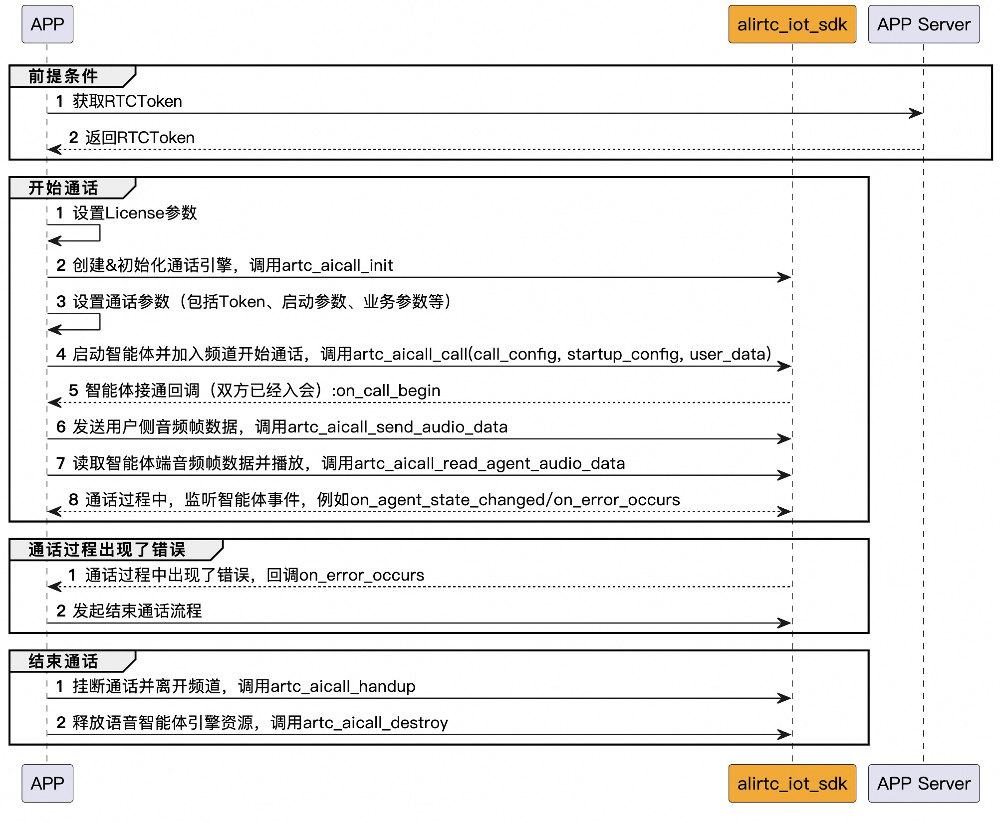

[English](README_English.md)

# AI实时互动Example（JL-AC791序列开发板）
阿里云 · AI实时互动演示Demo，适用于杰理AC791序列

## 介绍
本Demo主要演示杰理智能硬件与智能体的实时通话，并提供核心场景的接口调用参考。

## 源码说明

### 源码下载
[下载地址](https://github.com/MediaBox-Demos/amdemos-lot-aicall/tree/main/jl-ac791)

### 源码结构
```
├── alirtc_iot_sdk                 // Ali RTC SDK
│   ├── include                    // SDK 头文件目录
│   ├── lib                        // SDK .a库目录
├── app_main                       // 入口函数
├── artc_aicall_demo.c             // 智能体实时通话的Demo实现c文件
├── artc_aicall_demo.h             // 智能体实时通话的Demo实现h文件
├── artc_device_helper.c           // 封装设备操作函数（WiFi链接）
├── artc_device_helper.h           // 封装设备操作函数（WiFi链接）
├── artc_logger.h                  // 封装Log函数
├── audio_input2.c                 // 封装音频采集与播放
├── audio_input2.h                 // 封装音频采集与播放
├── board                          // 工程文件
├── include                        // 全局头文件配置

```

### 环境要求
- 搭建杰理AC791序列开发版环境，请参考[杰理开发环境安装说明](https://doc.zh-jieli.com/AC79/zh-cn/master/getting_started/environmental_install/index.html)


### 前提条件
- 申请License，请联系商务经理
- 开通及创建智能体，详情参考[AI实时互动官网文档](https://help.aliyun.com/zh/ims/user-guide/create-agents-for-audio-and-video-calls)。创建智能体后，得到`智能体Id`、`智能体所在区域`、智能体关联RTC的`AppId`及`AppKey`，这些值会在下面用到。

## 跑通Example源码

- Clone杰理的SDK: https://gitee.com/Jieli-Tech/fw-AC79_AIoT_SDK.git
- Clone本Demo源码到杰理的apps/demo里，Clone修改目录名为`demo_artc_aicall`，如下：
```
- FW-AC79_AIOT_SDK
  - apps
    - demo
      - demo_artc_aicall (注意，这里文件名是下划线分割)
```

- 在目录`demo_artc_aicall`里，使用CodeBlocks IDE 打开工程文件：`board/wl82/AC791N_DEMO_ARTC_AICALL.cbp`
- 进入`artc_device_helper.c`，修改WiFi的SSID及PWD
```c
// 设置WiFi的ssid及pwd，用于链接网络
#define WIFI_STA_SSID "ssid"
#define WIFI_STA_PWD  "pwd"
```

- 进入`artc_aicall_demo.c`，修改License及智能体信息
```c
// 智能体通话的License信息
#define LICENSE_PRODUCT_ID "xxx"  // License产品Id
#define LICENSE_AUTH_CODE "xxx"   // License授权码
#define LICENSE_DEVICE_ID "xxx"   // 设备唯一Id

// 当前用户参与智能体通话的用户Id
#define USER_ID "xxxx"               
// 智能体Id
#define VOICE_AGENT_ID "xxxx"
// 智能体所在的区域
#define AGENT_REGION "xxxx"
// 智能体关联的RTC应用Id
#define RTC_APP_ID "xxxx"
// 智能体关联的RTC应用Key
#define RTC_APP_KEY "xxxx"

```
> ❗❗❗注意：RTC_APP_KEY此次在本地生成签名Token，仅用于开发阶段的本地调试。对于线上版本，请勿内置RTC_APP_KEY，请使用服务端生成签名并下发方式。    
> ❗❗❗在 [**这里**](https://help.aliyun.com/zh/ims/user-guide/generate-artc-authentication-token?spm=a2c4g.11186623.help-menu-193643.d_2_5_7_2_3.33a578b03GRPer&scm=20140722.H_2922636._.OR_help-T_cn~zh-V_1) 参考如何生成Token，在智能硬件场景，生成的Token无需进行base64转化，直接把json结果下发给杰理

- 编译Demo工程，参考[杰理官网文档](https://doc.zh-jieli.com/AC79/zh-cn/master/getting_started/project_download/download.html)
- 运行Demo，通电后，按下下面按键与智能体进行互动：
    - `K1`： 启动智能体通话
    - `K2`： 挂断通话
    - `K3`： 打断智能体讲话
    - `K4`： 停止发送音频给智能体
    - `K5`： 继续发送音频给智能体
- 查看实时日志，请连接串口并且通过串口工具进行查看


## 智能体通话交互过程

<p align="center">
  
</p>
